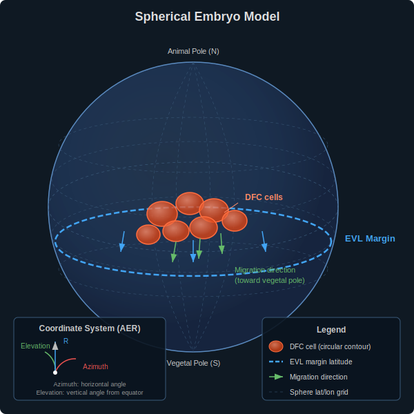
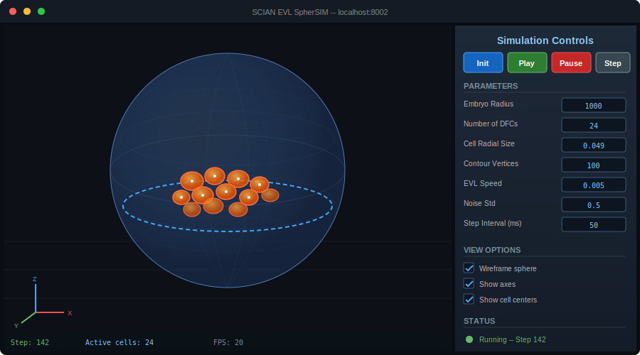
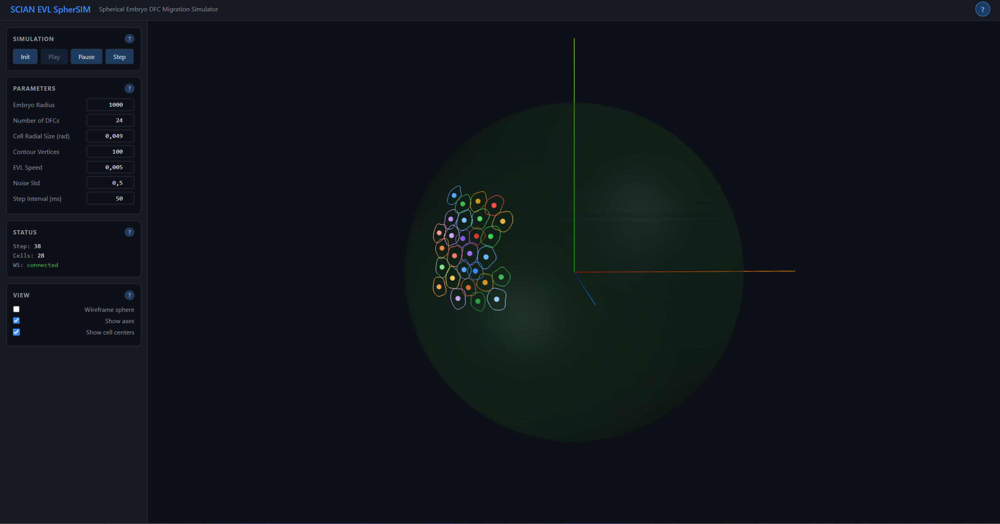

# SCIAN EVL SpherSIM

3D simulation of Deep Forming Cell (DFC) collective migration on a spherical zebrafish embryo surface during epiboly. Built with Python/FastAPI on the backend and Three.js for interactive browser-based 3D visualization.

DFCs are the precursor cells of Kupffer's vesicle, the zebrafish organ responsible for establishing left-right body asymmetry. This simulation models how DFCs are carried vegetalward by the advancing EVL (Enveloping Layer) margin, subject to stochastic noise and inter-cell collision constraints. The project is a complete rewrite of a legacy MATLAB implementation, designed for accessibility, real-time interactivity, and modularity.

---

## Motivation & Problem

During zebrafish epiboly, the EVL spreads vegetalward dragging DFCs through elastic apical attachments. This migration occurs on a curved spherical surface where standard flat-geometry collision detection fails near the poles. Correct geodesic mechanics are essential for biologically accurate simulation.


---

## KPIs — Impact & Value

| KPI | Impact |
|-----|--------|
| Geometric accuracy | First web-based simulator with geodesic-correct spherical mechanics |
| Platform migration | From MATLAB (license required) to Python (free, open source) |
| 3D interaction | Interactive Three.js orbit/zoom vs static MATLAB plots |
| Quantitative analysis | Real-time cluster metrics (spread, elongation) + CSV export |

## Spherical Embryo Model



The embryo is modeled as a sphere. DFC cells are represented as circular contours on the sphere surface, tracked in AER (Azimuth-Elevation-Radius) coordinates. The EVL margin is a latitude line that moves steadily toward the vegetal pole, dragging the DFC cluster along with it.

---

## Application



The browser interface provides a 3D viewport with orbit controls (rotate, pan, zoom) and a right-side panel for simulation parameters and playback controls.

## Frontend



---

## Technical Approach — Spherical Mechanics

### Geodesic Distance — Haversine Formula
On a sphere, the straight-line distance between two cells is meaningless — we need the great-circle (geodesic) distance:

```
d = 2 · arcsin(√(sin²(Δφ/2) + cos(φ₁)·cos(φ₂)·sin²(Δλ/2)))
```

where **φ** is elevation (latitude), **λ** is azimuth (longitude), and **d** is in radians. This is numerically stable for both small and large separations, unlike the flat approximation √(Δaz² + Δel²) which fails near the poles.

### EVL Elastic Coupling
DFCs maintain tight-junction attachments to the EVL, modeled as exponentially decaying springs:

```
F_EVL = k · d · exp(−d / λ)
```

where **k** is the spring constant, **d** is the cell-to-margin distance, and **λ ≈ 0.3 rad** is the decay length. Leader cells (close to EVL) feel strong pull; follower cells (far) feel weak pull — matching biological observations.

### YSL Ring Contraction
The yolk syncytial layer has an actomyosin ring that pulls DFCs azimuthally toward the cluster centroid:

```
F_ring = −k_ring · Δaz · exp(−d_margin / λ_ring)
```

This compacts the cluster laterally as it migrates vegetalward.

### Spherical Metric
The non-uniform metric on the sphere means equal azimuthal increments produce different physical distances at different latitudes:

```
ds² = R²(dθ² + cos²(θ) · dφ²)
```

At the equator cos(0)=1 (full distance); at 60° latitude cos(60°)=0.5 (half distance). Collision resolution must account for this — we use Cartesian tangent-plane push instead of AER-space push.

### Cluster Spread and Elongation
Summary statistics characterize how compact or elongated the DFC cluster is during migration:

```
Spread:      σ = √(mean(d²))
Elongation:  e = √(λ_max / λ_min)
```

where **d** is the great-circle distance of each cell from the cluster centroid, and **λ_max**, **λ_min** are the eigenvalues of the 2D inertia tensor of cell positions projected onto the tangent plane. An elongation of 1.0 means circular; values above 2.0 indicate a stretched, leader-follower configuration.

---

## Architecture


The system consists of a FastAPI server that runs the simulation engine and a Three.js frontend that renders the results in real time. Communication happens over REST (for initialization and control) and WebSocket (for continuous state streaming during playback).

## Pipeline


Per-tick processing flow: (1) initialize cells, (2) update positions with EVL velocity + noise, (3) detect pairwise collisions, (4) resolve overlaps on the tangent plane, (5) convert to Cartesian, (6) serialize state, (7) push to the Three.js renderer over WebSocket.

---

## Features

- Interactive 3D visualization of the embryo sphere and DFC cells using Three.js with WebGL
- Real-time simulation streaming via WebSocket at configurable tick intervals
- Configurable parameters: cell count, radial size, EVL speed, noise amplitude, and more
- Orbit controls for rotation, pan, and zoom with mouse or touch
- Play / Pause / Step controls for continuous or frame-by-frame simulation
- Wireframe overlay, axes helper, and cell center markers as toggleable view options
- Dark theme UI with blue accent color scheme
- Pairwise collision detection and symmetric resolution to prevent cell overlap
- AER coordinate system with automatic wrapping (azimuth) and clamping (elevation)
- 23 automated tests covering cells, collisions, geometry, and full simulation pipeline

## Project Metrics & Status

| Metric | Status |
|--------|--------|
| Tests | 24 passing |
| Collision resolution | Cartesian tangent-plane push (latitude-independent) |
| EVL coupling | Exponential spring F=k·d·exp(−d/λ) |
| Cell division | Stochastic on sphere with area conservation |
| Cluster metrics | Centroid, spread σ, elongation √(λ_max/λ_min) |

---

## Quick Start

```bash
cd SCIAN_EVL_SpherSIM
python -m venv .venv
source .venv/Scripts/activate
pip install -r requirements.txt

# Run tests
python tests/test_cell.py
python tests/test_collision.py
python tests/test_simulation.py

# Start application
python -m uvicorn app.main:app --reload --port 8002
# Open http://localhost:8002
```

### Port Assignment

**Port:** `8002` -- http://localhost:8002

This project is registered in the global port ledger at [CAOS_MANAGE infrastructure/vps/hetzner-fasl-prod/README.md](../../_Web_Projects/CAOS_MANAGE/infrastructure/vps/hetzner-fasl-prod/README.md). Port 8002 was allocated to SpherSIM to avoid collisions with sibling SCIAN/FASL science projects (LEO_CPM 8001, DinHot 8003, DualFotography 8004, SOFI_QDOTS 8005, 3D_Distance_Profiler 8008, 3D_GrainSize 8010). Any change must be reflected in the ledger first.

---

## Project Structure

```
SCIAN_EVL_SpherSIM/
├── app/
│   ├── __init__.py
│   ├── main.py                   # FastAPI application, REST + WebSocket endpoints
│   ├── simulation/
│   │   ├── __init__.py
│   │   ├── cell_dfc.py           # Individual DFC cell model (AER position, contour, update)
│   │   ├── layer_dfc.py          # DFC population management (grid init, collective update)
│   │   ├── layer_evl.py          # EVL margin kinematic model (latitude moves vegetalward)
│   │   ├── environment.py        # Global parameters (radius, speed, bounds, noise)
│   │   ├── collision.py          # Pairwise collision detection and resolution
│   │   └── geometry.py           # Coordinate conversions, great-circle distance, mesh generation
│   ├── api/
│   │   ├── __init__.py
│   │   └── routes.py             # Reserved for future endpoint expansion
│   └── static/
│       ├── index.html            # Single-page application shell
│       ├── css/style.css         # Dark theme stylesheet
│       └── js/
│           ├── app.js            # Orchestration: binds controls, renderer, WebSocket
│           ├── renderer3d.js     # Three.js scene: sphere, contours, orbit controls
│           ├── controls.js       # Parameter panel and status display
│           └── websocket.js      # WebSocket client with auto-reconnect
├── tests/
│   ├── __init__.py
│   ├── test_cell.py              # 10 tests: cell creation, update, wrapping, serialization
│   ├── test_collision.py         # 7 tests: distance, overlap, resolution, symmetry
│   └── test_simulation.py        # 6 tests: pipeline, serialization, geometry, bounds
├── docs/
│   ├── architecture.md                  # System design and API reference
│   ├── spherical_mechanics_theory.md    # Deep theory: metric, Haversine, forces, metrics
│   ├── biological_model.md              # Zebrafish biology and simulation model
│   ├── epiboly_biology.md               # Epiboly process biology
│   ├── development_history.md           # Changelog from MATLAB v1.x to Python v2.x
│   ├── references.md                    # Academic papers and software libraries
│   ├── user_guide.md                    # Installation, usage, and troubleshooting
│   ├── png/
│   │   └── frontend.png                 # Frontend screenshot
│   └── svg/
│       ├── architecture.svg             # System architecture diagram
│       ├── pipeline.svg                 # Per-tick processing pipeline
│       ├── spherical_model.svg          # Spherical embryo model
│       ├── coordinate_system.svg        # AER coordinate system
│       ├── cartesian_push.svg           # Cartesian push collision diagram
│       ├── epiboly_stages.svg           # Epiboly progression stages
│       ├── evl_coupling.svg             # EVL drag coupling diagram
│       └── app_screenshot.svg           # Application interface mockup
├── legacy/                       # Original MATLAB code and GUIDE files
├── build.spec                    # PyInstaller spec file
├── Build_PyInstaller.ps1         # PowerShell build script
├── run_app.py                    # Uvicorn launcher with auto-browser
└── requirements.txt              # Pinned Python dependencies
```

---

## API Summary

### REST Endpoints

| Method | Path | Description |
|---|---|---|
| `GET` | `/` | Serve the single-page application |
| `POST` | `/api/simulation/init` | Initialize simulation with config JSON |
| `POST` | `/api/simulation/start` | Begin continuous stepping |
| `POST` | `/api/simulation/stop` | Pause stepping |
| `POST` | `/api/simulation/step` | Advance one time step |
| `GET` | `/api/simulation/state` | Query current state snapshot |

### WebSocket

| Endpoint | Direction | Message |
|---|---|---|
| `ws://localhost:8002/ws/simulation` | Client to Server | `{ "action": "start" }`, `{ "action": "stop" }`, `{ "action": "speed", "value": 100 }` |
| | Server to Client | JSON with `dfc_layer` (cells, step count) and `environment` (radius, velocity, bounds) |

---

## Documentation

- [Architecture](docs/architecture.md) -- System design, API endpoints, WebSocket protocol, data flow
- [Spherical Mechanics Theory](docs/spherical_mechanics_theory.md) -- Deep equations reference: metric, Haversine, Cartesian push, EVL coupling, metrics
- [Biological Model](docs/biological_model.md) -- Zebrafish biology, DFC migration, collision model
- [Epiboly Biology](docs/epiboly_biology.md) -- Epiboly process and DFC context
- [Development History](docs/development_history.md) -- Changelog from MATLAB to Python/Web
- [References](docs/references.md) -- Academic papers and software libraries
- [User Guide](docs/user_guide.md) -- Installation, usage, parameters, troubleshooting

## Tech Stack

- **Backend:** Python 3.11+, FastAPI, Uvicorn, NumPy, SciPy, Pydantic
- **Frontend:** Three.js r128 (CDN), vanilla JavaScript, HTML5, CSS3
- **Communication:** REST API (JSON) + WebSocket (JSON streaming)
- **Testing:** 23 tests across 3 test files, run with plain Python (no framework required)

---

## References

- Oteiza et al. (2008). Origin and shaping of the laterality organ in zebrafish. *Development*, 135(16).
- Ablooglu et al. (2021). Apical contacts stemming from incomplete delamination. *eLife*, 10:e61495.
- Vincenty, T. (1975). Direct and inverse solutions of geodesics on the ellipsoid. *Survey Review*, 23(176).
- Rieu et al. (2000). Diffusion and deformations of single Hydra cells. *Biophysical Journal*, 79(4).

---

## License

Academic use. See institutional guidelines.
