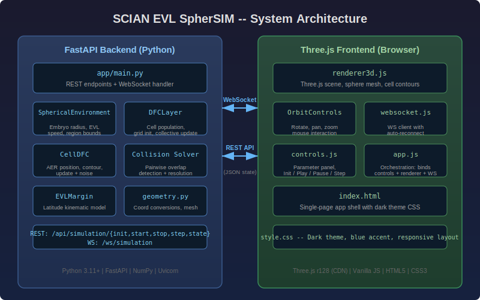
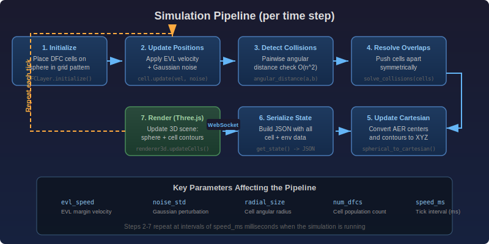

# System Architecture

## Overview

SCIAN EVL SpherSIM is a real-time simulation platform that models the collective migration of Deep Forming Cells (DFCs) on the surface of a spherical zebrafish embryo during epiboly. The application is split into two main layers: a **Python/FastAPI backend** that runs the simulation engine, and a **Three.js browser frontend** that provides interactive 3D visualization.



The backend performs all numerical computation -- cell position updates, noise injection, coordinate conversions, and collision resolution -- and streams the resulting state to the frontend over a WebSocket connection. The frontend is responsible exclusively for rendering and user interaction.

## Why FastAPI + Three.js

The original implementation of this simulation was written in MATLAB using the GUIDE framework for its graphical interface (see [Development History](development_history.md)). The migration to Python/FastAPI + Three.js was motivated by several factors:

- **Accessibility.** A web-based interface removes the MATLAB license requirement and allows anyone with a modern browser to run or view simulations.
- **Performance.** FastAPI is built on Starlette and supports asynchronous I/O natively. This makes it straightforward to maintain a WebSocket loop that streams simulation state at configurable intervals without blocking the server.
- **3D Rendering.** Three.js provides hardware-accelerated WebGL rendering with orbit controls, transparency, and real-time updates -- capabilities that MATLAB's `surf`/`plot3` could not match interactively.
- **Extensibility.** The REST + WebSocket API makes it possible to build alternative clients (e.g., a Jupyter notebook consumer, a headless batch runner) without modifying the simulation core.
- **Ecosystem.** Python's scientific stack (NumPy, SciPy) provides the same numerical primitives as MATLAB, with the added benefit of type hints, modern packaging, and straightforward testing.

## Component Descriptions

### Backend Modules

| Module | File | Purpose |
|---|---|---|
| **Application entry point** | `app/main.py` | Creates the FastAPI application, defines all REST and WebSocket endpoints, manages global simulation state, and serves the static frontend files. |
| **Spherical environment** | `app/simulation/environment.py` | Holds global parameters for a simulation run: embryo radius, EVL margin velocity vector, DFC placement bounds, noise amplitude, and step counter. |
| **DFC layer** | `app/simulation/layer_dfc.py` | Manages the population of DFC cells. Handles grid-based initialization within configurable azimuth/elevation bounds, per-step collective updates, and delegates collision resolution. |
| **DFC cell** | `app/simulation/cell_dfc.py` | Models a single DFC as a circular contour in spherical coordinates. Stores center position in AER (azimuth, elevation, radius), discretizes the contour into N vertices, integrates velocity with Gaussian noise, and converts to Cartesian for rendering. |
| **EVL margin** | `app/simulation/layer_evl.py` | Kinematic model of the Enveloping Layer margin. The margin is a latitude line that moves toward the vegetal pole at a constant angular speed. Provides the velocity vector that drives DFC migration. |
| **Collision solver** | `app/simulation/collision.py` | Detects pairwise overlaps by comparing the angular distance between cell centers against the sum of their radial sizes. Overlapping pairs are pushed apart symmetrically along their connecting direction. |
| **Geometry utilities** | `app/simulation/geometry.py` | Provides batch coordinate conversions (AER to XYZ and back), great-circle distance via the Haversine formula, and sphere mesh generation for the frontend. |
| **API routes (reserved)** | `app/api/routes.py` | Placeholder module for future endpoint expansion (parameter presets, file export, snapshot management). Currently all routes live in `main.py` for simplicity. |

### Frontend Modules

| Module | File | Purpose |
|---|---|---|
| **App shell** | `app/static/index.html` | Single-page HTML document that loads Three.js from CDN and imports the JavaScript modules. |
| **Orchestrator** | `app/static/js/app.js` | Binds the controls panel to the renderer and WebSocket client. Handles Init/Play/Pause/Step button actions. |
| **3D Renderer** | `app/static/js/renderer3d.js` | Creates the Three.js scene: sphere mesh, cell contour lines, cell center markers, wireframe overlay, axes helper, and orbit controls. Exposes an `updateCells()` method consumed on each WebSocket message. |
| **Controls** | `app/static/js/controls.js` | Reads parameter inputs from the HTML form, validates them, and provides getter methods for the orchestrator. Updates the status display. |
| **WebSocket client** | `app/static/js/websocket.js` | Manages the WebSocket connection to `/ws/simulation` with automatic reconnection on disconnect. Dispatches received state objects to the renderer. |
| **Stylesheet** | `app/static/css/style.css` | Dark theme with blue accent colors, responsive layout for the 3D viewport and right-side control panel. |

## API Endpoints

### REST

| Method | Path | Description |
|---|---|---|
| `GET` | `/` | Serves the single-page application (`index.html`). |
| `POST` | `/api/simulation/init` | Accepts a JSON body with simulation parameters (`SimConfig` schema). Creates a new `SphericalEnvironment` and `DFCLayer`, returns the number of cells created. |
| `POST` | `/api/simulation/start` | Sets the simulation to running mode. The WebSocket loop will begin stepping automatically. |
| `POST` | `/api/simulation/stop` | Pauses the simulation. The WebSocket loop continues but stops advancing the state. |
| `POST` | `/api/simulation/step` | Advances the simulation by exactly one time step and returns the full state snapshot. Useful for frame-by-frame debugging. |
| `GET` | `/api/simulation/state` | Returns the current state without advancing the simulation. |

### WebSocket Protocol

**Endpoint:** `ws://localhost:8002/ws/simulation`

**Client-to-server messages** (JSON):

```json
{ "action": "start" }
{ "action": "stop" }
{ "action": "speed", "value": 100 }
```

**Server-to-client messages** (JSON, sent each tick while running):

```json
{
  "dfc_layer": {
    "step": 42,
    "num_cells": 24,
    "cells": [
      {
        "center_aer": [az, el, r],
        "center_xyz": [x, y, z],
        "contour_xyz": [[x0,y0,z0], [x1,y1,z1], ...],
        "radial_size": 0.049,
        "active": true
      }
    ]
  },
  "environment": {
    "embryo_radius": 1000,
    "margin_velocity": [0, -0.00785, 0],
    "step": 42,
    "az_range": [-2.356, -1.571],
    "el_range": [0, 0.785]
  }
}
```

## Data Flow



The complete data flow for a typical user session:

1. **Initialization.** The user fills in parameter values in the control panel and clicks **Init**. The frontend sends a `POST /api/simulation/init` request containing the `SimConfig` JSON. The server instantiates a `SphericalEnvironment` and a `DFCLayer`, places cells in a grid, and returns a confirmation with the cell count.

2. **Connection.** When the page loads, the frontend opens a WebSocket connection to `/ws/simulation`. This connection persists for the lifetime of the session.

3. **Start.** The user clicks **Play**. The frontend sends `{ "action": "start" }` over the WebSocket. The server sets its internal `running` flag to `True`.

4. **Simulation loop.** On each tick (default 50 ms), the server checks the `running` flag. If true, it calls `environment.update()` to advance the step counter, then `dfc_layer.update(margin_velocity)` which iterates over all active cells, applies velocity + noise, and resolves collisions. The resulting state is serialized to JSON and pushed through the WebSocket.

5. **Rendering.** The frontend receives the JSON state and calls `renderer3d.updateCells()`, which repositions all cell contour lines and center markers in the Three.js scene. The browser renders the next frame.

6. **Pause.** The user clicks **Pause**. The frontend sends `{ "action": "stop" }`. The server loop continues but skips the stepping and broadcasting.

7. **Single step.** Alternatively, the user can click **Step** which calls `POST /api/simulation/step`. This advances exactly one tick and returns the state in the HTTP response (useful when the WebSocket is paused).

## Coordinate Convention

The simulation uses a spherical coordinate system internally (see [Coordinate System diagram](svg/coordinate_system.svg)):

- **Azimuth (az):** Longitude angle around the vertical axis, measured in radians. Wraps to [-pi, pi].
- **Elevation (el):** Latitude angle from the equatorial plane, measured in radians. Clamped to [-pi/2, pi/2].
- **Radius (R):** Distance from the sphere center. Constant for all points on the embryo surface.

Conversion to Cartesian follows the standard geographic convention:

```
x = R * cos(el) * cos(az)
y = R * cos(el) * sin(az)
z = R * sin(el)
```

The Three.js renderer maps simulation coordinates (x, y, z) to the Three.js axis convention (X-right, Y-up, Z-toward viewer) as `(x, z, -y)`.

## Deployment

The application is designed for local development and small-scale use:

```bash
python -m uvicorn app.main:app --reload --port 8002
```

For production or shared lab deployments, Uvicorn can be run behind a reverse proxy (e.g., Nginx) or within a container. The `--reload` flag should be removed in production. No database or external services are required -- all state lives in memory for the duration of the server process.
