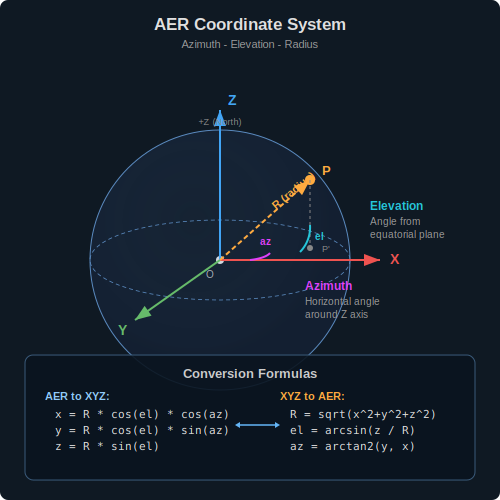

# Biological Model

## Zebrafish Embryo Development and Epiboly

During the first several hours after fertilization, a zebrafish embryo undergoes a dramatic series of cell movements collectively known as **epiboly**. At this stage, the embryo consists of a large yolk cell capped by a dome of dividing cells (the blastoderm). Over the course of epiboly, this cap of cells thins and spreads to eventually enclose the entire yolk, much like pulling a knit cap down over a balloon.

Three distinct tissue layers participate in this process:

- **EVL (Enveloping Layer):** The outermost single-cell-thick epithelial sheet. It is tightly connected at its advancing edge (the "margin") and provides a mechanical frontier that moves steadily toward the vegetal (bottom) pole of the embryo.
- **YSL (Yolk Syncytial Layer):** A multinucleated layer that sits directly on the yolk surface beneath the EVL. Contractile actomyosin networks within the YSL are thought to generate pulling forces that help drive the margin forward.
- **Deep cells:** The bulk of the blastoderm cells lying between the EVL and the yolk. These cells are loosely organized and will later give rise to all major embryonic tissues.

The geometry of the embryo at this stage is approximately spherical, which motivates the use of spherical coordinates in this simulation.

## Deep Forming Cells (DFCs) and Organ Formation

Among the deep cells, a small specialized population called **DFCs (Dorsal Forerunner Cells)** plays a critical role in establishing the left-right body axis. DFCs number roughly 20-30 cells and are located at the dorsal side of the advancing EVL margin.

Key biological characteristics of DFCs:

- **Apical attachment.** DFCs maintain physical connections to the underside of the EVL margin through apical membrane contacts. This attachment is what causes them to be dragged vegetalward as the EVL advances.
- **Collective migration.** DFCs do not move independently. They migrate as a loosely coherent cluster, with individual cells jostling and adjusting their positions relative to neighbors. This collective behavior is essential for what comes next.
- **Convergence.** As the EVL margin approaches the vegetal pole, the DFC cluster progressively tightens. Cells that were spread out along the dorsal margin converge toward the midline.
- **Vesicle formation.** Once the DFCs reach the vegetal region, they detach from the EVL, coalesce into a compact rosette, and form a fluid-filled cavity called **Kupffer's vesicle (KV)**. Motile cilia inside KV generate a directional fluid flow that breaks the embryo's bilateral symmetry and establishes left-right organ asymmetry.

When KV formation fails (due to insufficient DFC number, disrupted migration, or faulty adhesion), the embryo develops laterality defects -- organs that should be on the left side may end up on the right, or their placement becomes random.

## EVL Layer and the Epiboly Process

In this simulation, the EVL is not modeled as a population of individual cells. Instead, it is represented as a **kinematic boundary**: a latitude line on the sphere that moves toward the south pole at a constant angular velocity. This simplification captures the essential role of the EVL as a "conveyor belt" that carries the DFCs along, without the computational cost of simulating the thousands of EVL cells individually.

The EVL margin velocity is the primary external force acting on the DFC population. Every DFC cell receives this velocity vector at each time step, which shifts its position toward lower elevations (i.e., toward the vegetal pole).


## Spherical Coordinate Representation

The embryo is modeled as a perfect sphere of configurable radius (default: 1000 spatial units). All cell positions and movements are tracked in an **AER (Azimuth-Elevation-Radius)** coordinate system:

- **Azimuth** is the horizontal angle around the vertical axis, analogous to longitude on the Earth. It ranges from -pi to pi radians.
- **Elevation** is the vertical angle measured from the equatorial plane, analogous to latitude. It ranges from -pi/2 (south pole, vegetal) to +pi/2 (north pole, animal).
- **Radius** is the distance from the sphere center. Since all cells sit on the surface, this value equals the embryo radius and remains constant.



Each DFC cell is represented as a circular contour on the sphere surface. The contour is defined by an angular radius (`radial_size`, approximately pi/64 radians by default) and discretized into N evenly spaced vertices:

```
vertex[i].azimuth   = center.azimuth   + radial_size * cos(2 * pi * i / N)
vertex[i].elevation = center.elevation  + radial_size * sin(2 * pi * i / N)
vertex[i].radius    = embryo_radius
```

This is an approximation: the vertices trace a circle in angular space rather than a true geodesic circle on the curved surface. For the small cell sizes used in this simulation (angular radius ~ 3 degrees), the difference is negligible.

## Migration Model

### Deterministic Component

At each time step, every active DFC cell receives a base velocity vector derived from the EVL margin:

```
base_velocity = [0, -(pi/2) * evl_speed, 0]
```

This vector has zero azimuthal component (no east-west drift from the EVL alone) and a negative elevation component (southward migration). The radial component is zero because cells remain on the sphere surface.

### Stochastic Component

Biological cell migration is inherently noisy. Cells fluctuate in their speed and direction due to internal signaling variability, cytoskeletal dynamics, and interactions with the local microenvironment. The simulation captures this through a **Gaussian noise term** applied to both the azimuthal and elevation components of the velocity:

```
noise_az = noise_std * |base_velocity_el| * N(0,1)
noise_el = noise_std * |base_velocity_el| * N(0,1)
```

The noise amplitude is scaled by the absolute elevation velocity so that faster-moving cells experience proportionally larger fluctuations. The `noise_std` parameter controls the overall noise level and can be adjusted by the user.

### Position Integration

After computing the actual velocity (base + noise), the cell center is updated:

```
center_aer += actual_velocity
```

Post-update, the azimuth is wrapped to [-pi, pi] (periodic boundary) and the elevation is clamped to [-pi/2, pi/2] (cells cannot pass through the poles). The Cartesian center and contour vertices are then recomputed from the updated spherical coordinates.

## Collision Detection on Curved Surfaces

When multiple cells migrate simultaneously, they may overlap. The simulation prevents this through a pairwise collision detection and resolution scheme.

### Detection

For each pair of active cells, the angular distance between their centers is computed:

```
angular_dist = sqrt((az_a - az_b)^2 + (el_a - el_b)^2)
```

This is a flat-space (Euclidean) approximation in the azimuth-elevation plane. For cells that are close together (as DFCs typically are), this approximation is accurate. A collision is detected when `angular_dist < radial_size_a + radial_size_b`.

### Resolution

When two cells overlap, they are pushed apart symmetrically along the direction connecting their centers. Each cell is displaced by half the overlap distance:

```
overlap = (size_a + size_b) - angular_dist
push = overlap / 2
direction = normalize(center_a - center_b)
center_a += direction * push
center_b -= direction * push
```

This ensures that the midpoint of the cell pair remains fixed and that neither cell is preferentially displaced. After adjustment, each cell's Cartesian coordinates and contour are rebuilt.

The solver checks all pairs in O(n^2) time, which is acceptable for the typical DFC population of approximately 24 cells.

## Simplifications and Assumptions

This simulation intentionally omits several biological complexities to focus on the core migration dynamics:

- **Perfect sphere.** The embryo surface is treated as a rigid sphere with no deformation, curvature changes, or surface tension effects.
- **Angular contours.** Cell boundaries are circles in angular space, not true geodesic circles. The error is small for the cell sizes used.
- **No adhesion.** There is no explicit cell-cell adhesion model. Cells interact only through repulsive collision resolution.
- **Constant EVL speed.** The EVL margin moves at a fixed angular velocity with no feedback from the DFC population or the yolk cell.
- **No proliferation or death.** Cells do not divide or undergo apoptosis during the simulation.
- **No mechanical forces.** There is no explicit force model (tension, pressure, viscosity). Cell movement is purely kinematic with stochastic perturbation.

These simplifications keep the model tractable and fast enough for real-time interactive exploration, while still capturing the essential features of DFC collective migration: directional transport by the EVL, stochastic variability, and contact-mediated crowding.
